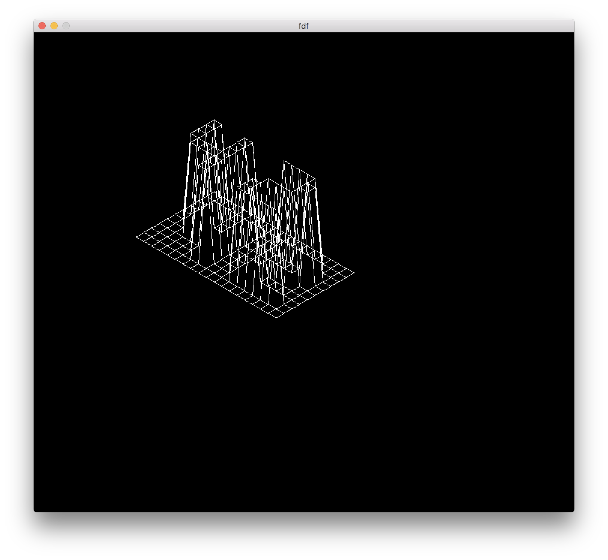
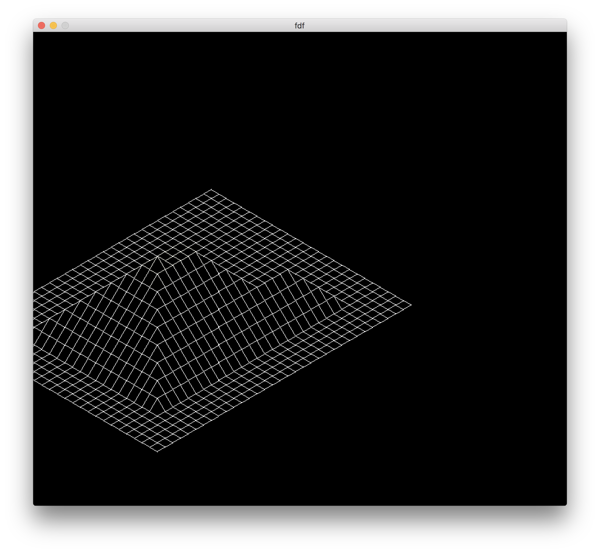

# FDF

Wire frame model from 2 dimensional file

Demo maps included in test_maps

Developed for macOS High Sierra using clang-902.0.39.1

## Installation

```bash
make
```

## Usage

./fdf test_maps/42.fdf i




